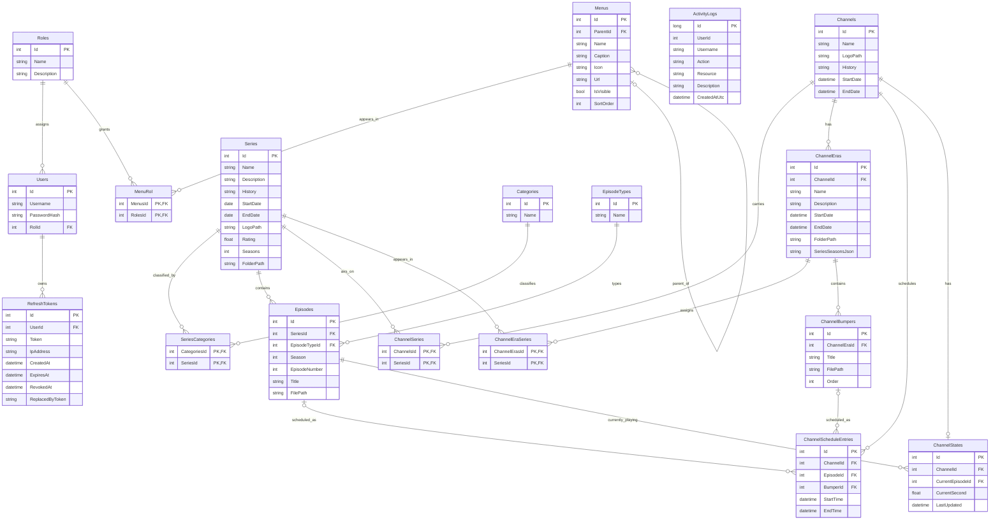
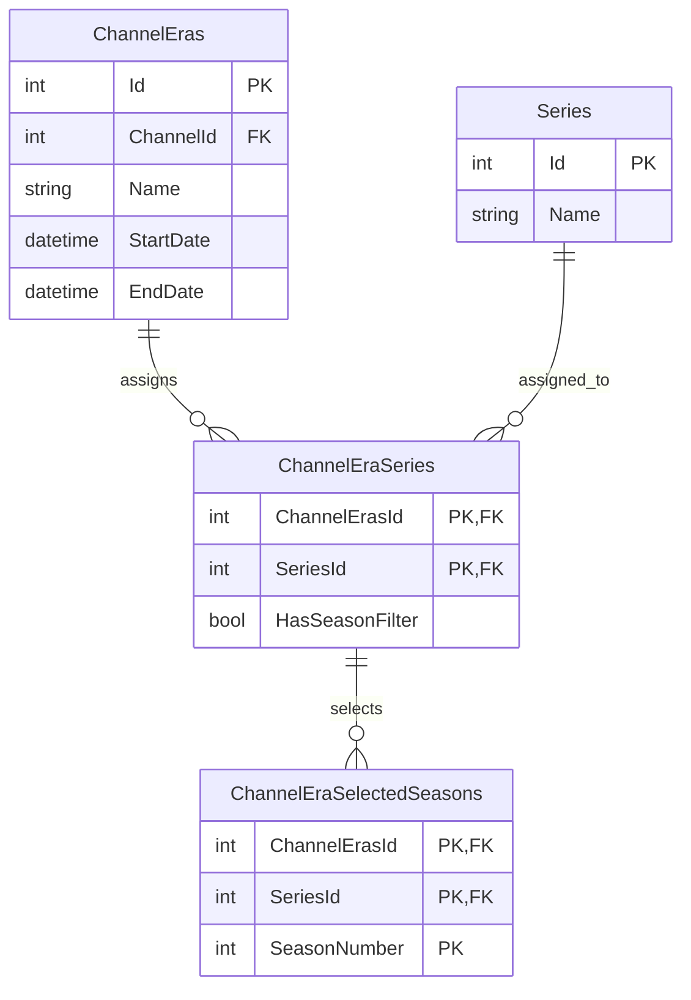
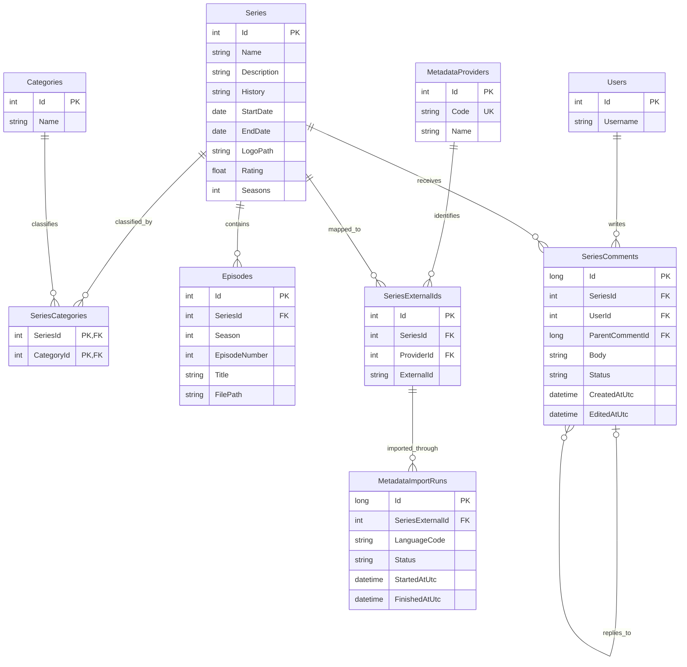
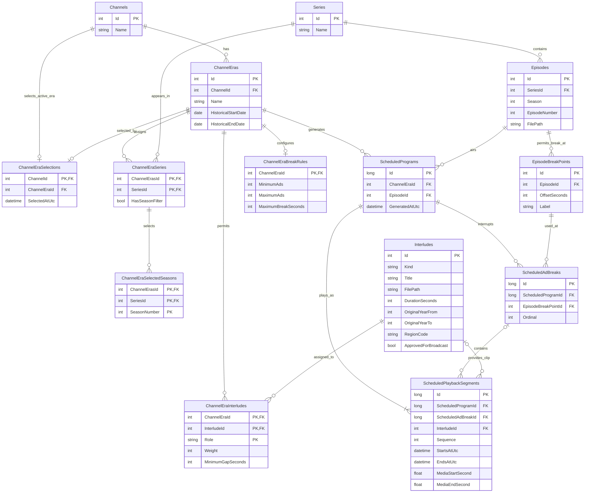

# NostalgiaTV database schema

This diagram reflects the EF Core model and migrations on `develop` before the normalization change. It does not assert that a running VPS database has the same schema or data.

## Current model

`ActivityLogs.UserId` is not an EF foreign key. Its `Username` is a historical audit snapshot, so it should not be removed merely because `Users.Username` exists.

## Normalized era-season selection

Only this fragment changes; every other relationship above remains intact.

`HasSeasonFilter = false` means all seasons. `HasSeasonFilter = true` with no season rows means no seasons. With season rows, only those seasons are allowed. The composite key prevents duplicate season selections, and the composite foreign key prevents selections for an unassigned series.

The JSON-to-row change removes the confirmed multivalued attribute from `ChannelEras`. Existing independent many-to-many facts already use junction tables. A blanket 5NF claim would require verified business join dependencies, not just an EF model.

## Proposed platform model (not implemented)

The following is a future-state design. It does not describe the current database or a pending migration.

### Catalog, public metadata, and comments

`Series` remains the local canonical record. `SeriesExternalIds` has a unique `(ProviderId, ExternalId)` pair, so imports match existing series rather than creating duplicates. An import run records provenance and status; API credentials stay outside the database. Imported fields should be reviewed before replacing local edits. Replies must reference a comment on the same series; public comments require moderation and rate limiting.

### Retro channels and broadcast playback

An era is the channel's historical editorial identity (for example, a City or Check It period), including its series, selected seasons, and matching clips. `HistoricalStartDate` and `HistoricalEndDate` describe the original period; they do not activate it. `ChannelEraSelections` explicitly chooses one active era per channel, and its composite `(ChannelId, ChannelEraId)` foreign key must ensure the selected era belongs to that channel.

`EpisodeBreakPoints` records safe offsets within an episode. A generated airing is one `ScheduledProgram` with ordered `ScheduledPlaybackSegments`; each episode segment stores its source-media start and end offsets. `ScheduledAdBreaks` groups the clips inserted at a chosen break point. `ChannelEraInterludes.Role` is `BreakOpener`, `Advertisement`, or `BreakCloser`; the same clip may be eligible in multiple eras and roles. `ChannelEraBreakRules` controls the ad count and maximum break length. Only approved clips eligible for the selected era may be scheduled.

Example: episode 0–600 s → opening bumper → one or more ads → closing bumper → same episode 600 s–end. The generated UTC segment times form one continuous, non-overlapping channel timeline shared by all viewers; playback resumes at each episode segment's `MediaStartSecond`. A scheduled break must belong to the same program and refer to a break point of that program's episode. Its ordered clips must contain exactly one opener, at least the configured minimum number of ads, and exactly one closer. Each segment is either an episode range (no interlude or ad-break ID) or an interlude in an ad break (both IDs present and no episode offsets). Enforce row-local ranges with checks and cross-row sequence/eligibility in generation plus validation before publishing a schedule.

The current broadcast position is derivable from the active segment and UTC time, so no persistent playback-state table is proposed without a separate requirement. Migration must preserve existing schedules and explicitly select eras; the current `ChannelSeries` fallback and `ChannelBumpers` need mapping before retirement. This model remains proposed only: the current API does not yet split episodes or generate ad breaks.
